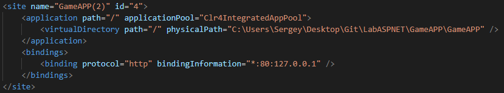

# Игра пятнашки (Fifteen)
- Разработана на платформе ASP .NET MVC 5 Fraemwork
- Описание игры можно увидеть по ссылке: https://ru.wikipedia.org/wiki/%D0%98%D0%B3%D1%80%D0%B0_%D0%B2_15

### Основные использованные технологии при разработке на платформа ASP .NET MVC 5 Fraemwork:
1. язык программирования "С#", "JavaScript";
2. движок представлении "RAZOR";
3. фреймворк "Jquery", "Entity Fraemwork 6";
5. язык разметки "HTML-5";
6. язык описания внешнего вида документов "CSS-3";
7. среда разработки @visual studio 2019;
8. программная платформа "net framework 4.7";
9. серверная служба "iss-express".

### Для запуска сервера с игрой необходимо:
1. "Visual Studio" с установленным пакетом "net framework 4.7";
2. установленый пакет для разработки ASP .NET MVC приложений;
3. в некоторых случаях требуется запускать Visual Studio с правами администратора, по причине требования встроенного сервера "iss-express";
4. перед запуском рекомендуеться проверить файл конфигурации проекта "applicationhost.config", который можно найти по пути "LabASPNET\GameAPP\.vs\GameAPP\config\" и проверить правильно ли пропипасаны пути к проекту и адрес сервера. Пример правильной конфигурации:

5. запуск рекомендуеться производить на операционной системе не ниже "Windows 7";

### Приложение протестировано в следующих веб-браузерах:
1. "Google Chrome" ("desktop");
2. "Mozilla Firefox" ("desktop");
3. "Microsoft Edge" ("desktop");
4. "Google Chrome" ("Android");

# Правила игры
На поле будут перемешаны фрагменты картинки. Один фрагмент будет пустым. Нажатием на клетку,
расположенной рядом (сверху, снизу, справа, слева) с пустой, поменяет их местами. Для победы требуется
расставить все фрагменты на свои места. И сделать это за как можно меньшее количество ходов.
Лучший счёт будет записан в таблицу рекордов.

